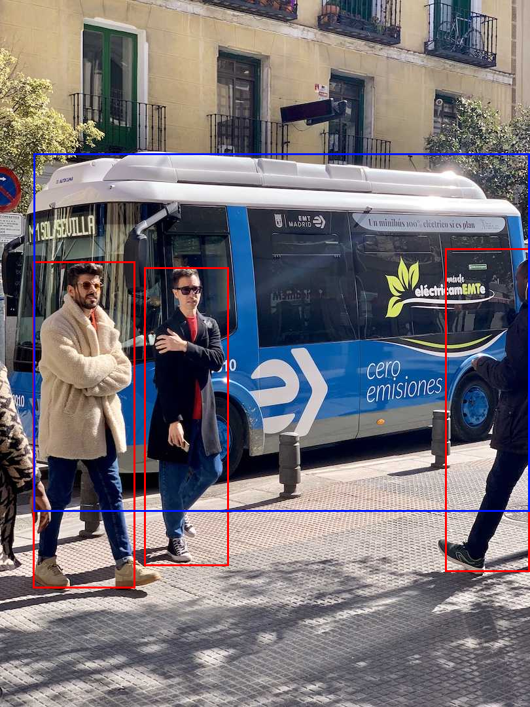
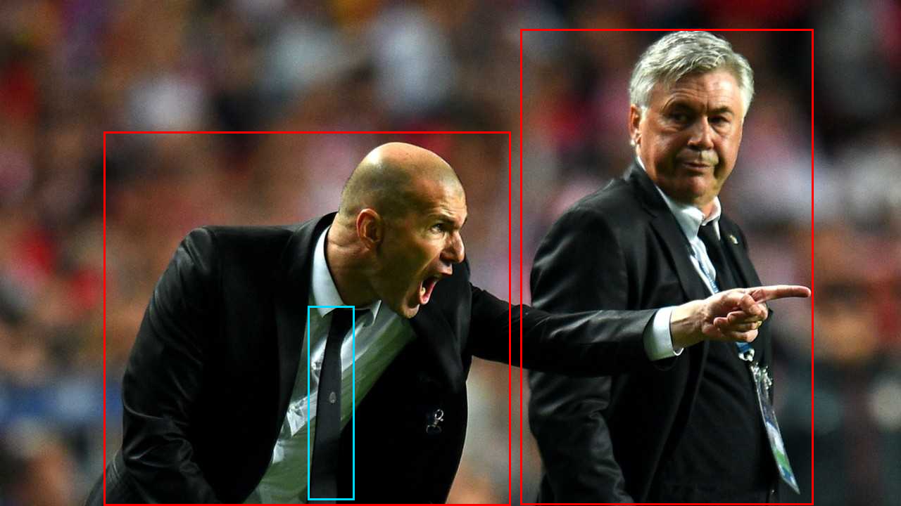

# yolov5_cpp

Training **YOLOv5** (the classic anchor-based model) in C++ with **zero external
dependencies** — a from-scratch reverse-mode autograd engine, C++ standard library only
(plus two vendored single-header image libs for the demo). Every step is **verified
numerically against the original Ultralytics YOLOv5** (PyTorch).

日本語: 本物の anchor ベース YOLOv5 を C++ で学習する実験。自作 autograd エンジン
（標準ライブラリのみ）で yolov5n の順伝播・損失・学習・推論を再現し、各段階を本家
（`torch.hub` の ultralytics/yolov5）と数値比較して確かめる。CPU / OpenMP は `-fopenmp`
の有無だけで切り替え。姉妹プロジェクト: **yolov8_cpp**。

The autograd engine (`pure/autograd.hpp` — im2col+GEMM conv, BN, SiLU, pool, upsample,
concat, …), optimizers, dataloader and COCO-mAP are shared with **yolov8_cpp**. What is
new here is YOLOv5's architecture and its **anchor-based loss** (box CIoU + objectness
BCE + class BCE, `build_targets` with wh-ratio anchor matching — no DFL, no TAL).

## Status
| file | milestone | result |
|------|-----------|--------|
| `pure/net5.hpp` + `pure/m1_forward.cpp` | **full yolov5n forward** (Conv / C3 / SPPF / anchor head) | matches yolov5n ~2e-5 |
| `pure/loss5.hpp` + `pure/m2_loss.cpp` | **anchor-based v5 loss** (build_targets + box CIoU + obj BCE + cls BCE) fwd+bwd | matches yolov5 `ComputeLoss`: loss ~6e-8, grads ~3e-9 |
| `pure/m3_train.cpp` | **end-to-end training** (forward → loss → backward → Adam/cosine) | loss 3.3 → 1.1 |
| `pure/infer5.hpp` + `pure/m4_infer.cpp` | **inference: anchor decode + NMS** | dets match yolov5 ~2e-4 |
| `pure/m5_demo.cpp` | **real-image inference** (stb_image → letterbox → detect → annotate) | bus + 3 people |
| `pure/metrics.hpp` + `pure/m6_map.cpp` | **COCO mAP** (AP@0.50, AP@0.50:0.95) | match pycocotools ~3e-7 |

## Demo — real-image detection, no Python, no libraries
Weights ship in the repo (`weights/yolov5n/`), so the pure detector runs from a checkout
with only a C++ compiler + the two vendored single-header image libs:
```sh
g++ -std=c++20 -O2 -Ipure/third_party pure/m5_demo.cpp -o m5_demo   # or cl /std:c++20 /O2 /EHsc /Ipure\third_party pure\m5_demo.cpp
./m5_demo assets/bus.jpg bus_out.png 640
```
| `assets/bus.jpg` → | `assets/zidane.jpg` → |
|---|---|
|  |  |

These match yolov5n's own output (boxes ~2e-4 on the letterboxed input, same classes —
see `pure/m4_infer.cpp`). Decode + NMS are in `pure/infer5.hpp`.

## Build
```sh
# reference weights (needs: torch, and the yolov5 hub deps pandas/seaborn/… )
python pure/ref/export_yolov5.py 64        # dump yolov5n fused weights + reference forward

# pure track — just a compiler
g++ -std=c++20 -O2            pure/m1_forward.cpp -o m1     # CPU
g++ -std=c++20 -O2 -fopenmp   pure/m1_forward.cpp -o m1     # OpenMP (same result)
cl /std:c++20 /O2 /EHsc pure/m1_forward.cpp                 # MSVC (std::thread parallelism)
./m1
```

## Licenses & attribution
The repository's own code is **BSD 3-Clause** — see [LICENSE](LICENSE). Bundled
third-party components keep their own licenses (Ultralytics YOLOv5 weights **AGPL-3.0**,
stb **public-domain / MIT**) — see [THIRD_PARTY_NOTICES.md](THIRD_PARTY_NOTICES.md).
